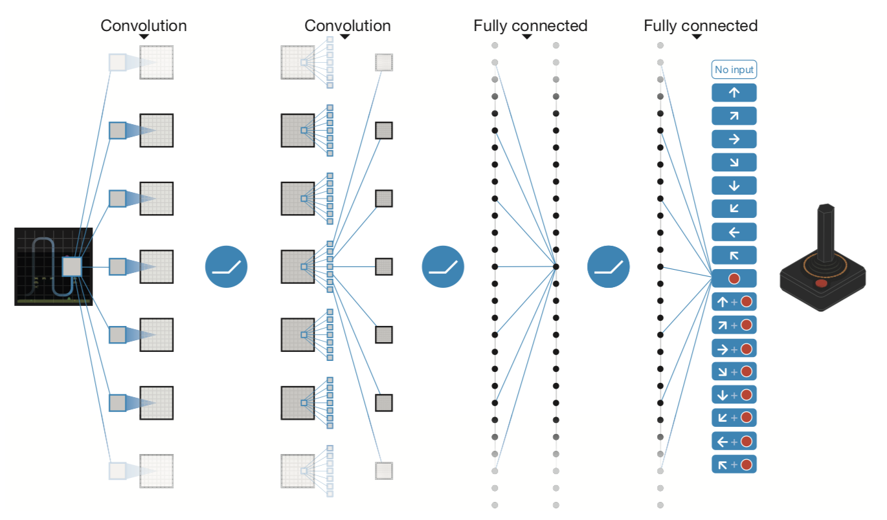
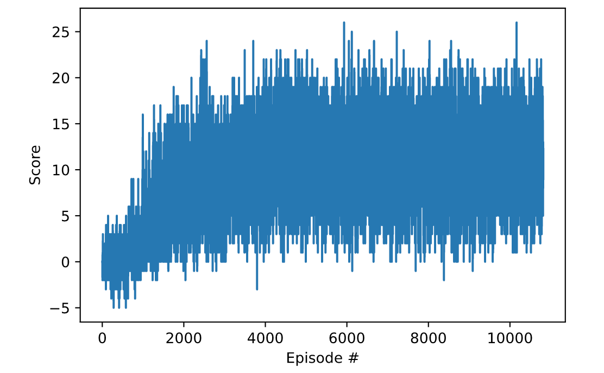

# Project 1: Navigation

## Learning Algorithm

### Deep Q-Network (DQN)

A DQN, or Deep Q-Network, approximates a state-value function in a Q-Learning framework with a neural network. In the Atari Games case, they take in several frames of the game as an input and output state values for each action as an output.

It is usually used in conjunction with Experience Replay, for storing the episode steps in memory for off-policy learning, where samples are drawn from the replay memory at random. Additionally, the Q-Network is usually optimized towards a frozen target network that is periodically updated with the latest weights every k steps (where k is a hyperparameter). The latter makes training more stable by preventing short-term oscillations from a moving target. The former tackles autocorrelation that would occur from on-line learning, and having a replay memory makes the problem more like a supervised learning problem.

### Illustration of DQN Architecture ([Source](https://storage.googleapis.com/deepmind-media/dqn/DQNNaturePaper.pdf))



### Hyperparameters

```python
BUFFER_SIZE = int(1e5)  # replay buffer size
BATCH_SIZE = 64         # minibatch size
GAMMA = 0.99            # discount factor
TAU = 1e-3              # for soft update of target parameters
LR = 5e-4               # learning rate 
UPDATE_EVERY = 4        # how often to update the network
```

## Plot of Rewards



* log
```
Episode 100	Average Score: -0.09
Episode 200	Average Score: 0.33
Episode 300	Average Score: 0.06
Episode 400	Average Score: 0.34
Episode 500	Average Score: 0.19
Episode 600	Average Score: 0.60
Episode 700	Average Score: 0.77
Episode 800	Average Score: 0.78
Episode 900	Average Score: 1.96
Episode 1000	Average Score: 2.59
Episode 1100	Average Score: 3.56
Episode 1200	Average Score: 4.37
Episode 1300	Average Score: 5.48
Episode 1400	Average Score: 6.36
Episode 1500	Average Score: 5.66
Episode 1600	Average Score: 5.60
Episode 1700	Average Score: 6.37
Episode 1800	Average Score: 7.91
Episode 1900	Average Score: 7.75
Episode 2000	Average Score: 7.47
Episode 2100	Average Score: 8.14
Episode 2200	Average Score: 7.79
Episode 2300	Average Score: 7.41
Episode 2400	Average Score: 7.11
Episode 2500	Average Score: 9.80
Episode 2600	Average Score: 9.50
Episode 2700	Average Score: 8.63
Episode 2800	Average Score: 8.02
Episode 2900	Average Score: 8.11
Episode 3000	Average Score: 8.06
Episode 3100	Average Score: 9.08
Episode 3200	Average Score: 9.38
Episode 3300	Average Score: 9.39
Episode 3400	Average Score: 10.09
Episode 3500	Average Score: 9.56
Episode 3600	Average Score: 9.21
Episode 3700	Average Score: 10.46
Episode 3800	Average Score: 10.07
Episode 3900	Average Score: 10.95
Episode 4000	Average Score: 10.85
Episode 4100	Average Score: 10.70
Episode 4200	Average Score: 10.78
Episode 4300	Average Score: 12.39
Episode 4400	Average Score: 11.51
Episode 4500	Average Score: 11.40
Episode 4600	Average Score: 10.92
Episode 4700	Average Score: 12.18
Episode 4800	Average Score: 11.73
Episode 4900	Average Score: 11.96
Episode 5000	Average Score: 11.48
Episode 5100	Average Score: 11.65
Episode 5200	Average Score: 12.32
Episode 5300	Average Score: 11.35
Episode 5400	Average Score: 10.21
Episode 5500	Average Score: 10.02
Episode 5600	Average Score: 11.09
Episode 5700	Average Score: 10.44
Episode 5800	Average Score: 11.02
Episode 5900	Average Score: 12.07
Episode 6000	Average Score: 10.79
Episode 6100	Average Score: 10.30
Episode 6200	Average Score: 10.70
Episode 6300	Average Score: 11.00
Episode 6400	Average Score: 11.50
Episode 6500	Average Score: 11.72
Episode 6600	Average Score: 11.97
Episode 6700	Average Score: 10.86
Episode 6800	Average Score: 11.44
Episode 6900	Average Score: 11.05
Episode 7000	Average Score: 10.70
Episode 7100	Average Score: 10.93
Episode 7200	Average Score: 10.89
Episode 7300	Average Score: 11.32
Episode 7400	Average Score: 10.82
Episode 7500	Average Score: 10.79
Episode 7600	Average Score: 10.75
Episode 7700	Average Score: 10.92
Episode 7800	Average Score: 10.34
Episode 7900	Average Score: 11.09
Episode 8000	Average Score: 11.41
Episode 8100	Average Score: 10.76
Episode 8200	Average Score: 11.37
Episode 8300	Average Score: 11.69
Episode 8400	Average Score: 10.34
Episode 8500	Average Score: 11.43
Episode 8600	Average Score: 11.71
Episode 8700	Average Score: 10.50
Episode 8800	Average Score: 10.60
Episode 8900	Average Score: 11.26
Episode 9000	Average Score: 11.13
Episode 9100	Average Score: 11.46
Episode 9200	Average Score: 10.79
Episode 9300	Average Score: 10.91
Episode 9400	Average Score: 9.93
Episode 9500	Average Score: 11.58
Episode 9600	Average Score: 10.91
Episode 9700	Average Score: 12.03
Episode 9800	Average Score: 11.69
Episode 9900	Average Score: 10.78
Episode 10000	Average Score: 11.30
Episode 10100	Average Score: 9.74
Episode 10200	Average Score: 10.00
Episode 10300	Average Score: 11.40
Episode 10400	Average Score: 11.41
Episode 10500	Average Score: 11.24
Episode 10600	Average Score: 11.37
Episode 10700	Average Score: 12.63
Episode 10800	Average Score: 12.55
Episode 10818	Average Score: 13.00
Environment solved in 10718 episodes!	Average Score: 13.00
```

## Ideas for Future Work

### Prioritized Experience Replay

[Prioritized experienced replay](https://arxiv.org/abs/1511.05952) is based on the idea that the agent can learn more effectively from some transitions than from others, and the more important transitions should be sampled with higher probability.

### Double DQN

Deep Q-Learning [tends to overestimate](https://www.ri.cmu.edu/pub_files/pub1/thrun_sebastian_1993_1/thrun_sebastian_1993_1.pdf) action values. [Double Q-Learning](https://arxiv.org/abs/1509.06461) has been shown to work well in practice to help with this.

### Dueling DQN

Currently, in order to determine which states are (or are not) valuable, we have to estimate the corresponding action values for each action. However, by replacing the traditional Deep Q-Network (DQN) architecture with a [dueling architecture](https://arxiv.org/abs/1511.06581), we can assess the value of each state, without having to learn the effect of each action.

## Reference 

* Udacity Deep Reinforcement Learning Nanodegree program
  * https://classroom.udacity.com/nanodegrees/nd893
  * https://github.com/udacity/deep-reinforcement-learning

* papers with code 
  * https://paperswithcode.com/method/dqn
